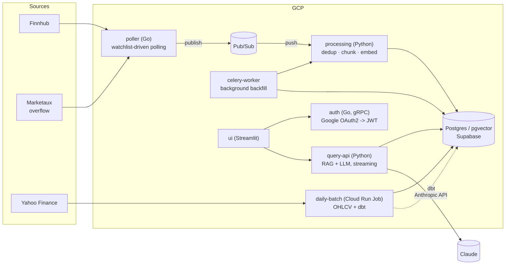

# Stock News Digest

A microservices system that continuously ingests stock-related news for symbols users are watching, embeds it into a vector database, and answers questions about it via retrieval-augmented generation (RAG) — plus a parallel structured-data pipeline (daily prices, a small feature store) for stats. Built as a portfolio project to demonstrate event-driven ingestion, dynamic subscription management, ETL/ELT for both structured and unstructured data, vector search, cloud deployment, and CI/CD with infrastructure as code.

Full requirements: [`docs/stock-news-digest-requirements.md`](docs/stock-news-digest-requirements.md). Current build status: [`docs/milestone.md`](docs/milestone.md). Why things are built the way they are: [`docs/decision_log.md`](docs/decision_log.md) (user-directed decisions) and [`docs/decision_log_claude.md`](docs/decision_log_claude.md) (bugs found and fixed, autonomous implementation choices).

## Architecture



Six deployables, all on Cloud Run (five services + one job):

| Service | Language | Role |
|---|---|---|
| [`auth`](services/auth) | Go, gRPC | Google OAuth2 identity exchange, JWT issuance |
| [`poller`](services/poller) | Go | Re-reads the watchlist each cycle, polls Finnhub (primary) + Marketaux (overflow), publishes to Pub/Sub |
| [`processing`](services/processing) | Python | Three-tier dedup, chunking, embedding, Postgres/pgvector writes |
| [`query-api`](services/query-api) | Python | RAG retrieval + streaming LLM answers, watchlist/feed/stats endpoints, Celery task producer |
| `celery-worker` | Python (query-api image) | Background jobs off the request path: watchlist-add backfill, paginated "load older news" |
| [`daily-batch`](services/daily-batch) | Python | Cloud Run *Job* (not a service, to avoid idle billing) — pulls daily OHLCV from Yahoo Finance, runs dbt into a small feature store |
| [`ui`](services/ui) | Python, Streamlit | Login, watchlist management, live feed, chat/query panel, stats dashboard |

Why a queue in two different places: Pub/Sub decouples the poller's unbounded async arrivals from processing; Celery + CloudAMQP exists separately so a user-initiated `POST /watchlist` can return instantly instead of blocking on a slow/flaky Finnhub backfill. Full reasoning for both in the decision logs.

**Data store**: everything — unstructured articles/embeddings and structured prices/features alike — lives in one Postgres instance (Supabase, pgvector extension). BigQuery was in the original design but deliberately skipped at the cloud migration: no real performance or cost problem it solves at this project's current data volume. See `docs/decision_log.md`'s "Deferred to v2" section for the reasoning on when that might change.

## Running locally

```bash
cp .env.example .env   # fill in ANTHROPIC_API_KEY, FINNHUB_API_KEY, JWT_SIGNING_SECRET (MARKETAUX_API_KEY optional)
docker compose up
```

| Service | Local URL |
|---|---|
| UI | http://localhost:8501 |
| processing | http://localhost:8001 |
| query-api | http://localhost:8002 |
| auth (gRPC) | localhost:50051 (loopback only) |
| poller | http://localhost:8080 (loopback only) |

Local dev runs the real GCP Pub/Sub emulator (genuine push subscriptions, not a stand-in) and a local RabbitMQ for Celery — see [`docker-compose.yml`](docker-compose.yml).

## Testing

Each service has its own unit tests (no external dependencies) plus integration tests that talk to a real Postgres (`docker compose up -d postgres` first — integration tests skip cleanly if it's unreachable, they don't fail).

```bash
# Python services (query-api, processing, ui, daily-batch)
cd services/<name> && uv run python -m pytest -v

# Go services (auth, poller)
cd services/<name> && go test ./internal/...
```

CI ([`.github/workflows/ci.yml`](.github/workflows/ci.yml)) runs all of the above plus `ruff check`/`go vet`/`gofmt` against a real Postgres service container on every push and PR. `main` and `dev` both require it to pass before merging.

## Infrastructure

Terraform ([`infra/terraform/`](infra/terraform/)) manages every GCP resource: Cloud Run services/jobs, Pub/Sub, Secret Manager, Cloud Scheduler, Artifact Registry, and the per-service IAM matrix (only `ui` is publicly invokable; everything else requires a real Cloud Run identity token). CD ([`.github/workflows/cd.yml`](.github/workflows/cd.yml)) runs `terraform plan` on PRs touching `infra/terraform/**` and `apply` on merge to `main`, authenticated via Workload Identity Federation — no long-lived GCP key ever leaves GCP.

## Docs

- [`docs/stock-news-digest-requirements.md`](docs/stock-news-digest-requirements.md) — full spec, v1 and v2
- [`docs/api-spec.md`](docs/api-spec.md) — endpoints, auth model, per-service IAM
- [`docs/er-diagram.md`](docs/er-diagram.md) — schema
- [`docs/project-structure.md`](docs/project-structure.md) — directory layout and architectural pattern per service
- [`docs/milestone.md`](docs/milestone.md) — what's built, what's live-verified, what's left
- [`docs/decision_log.md`](docs/decision_log.md) / [`docs/decision_log_claude.md`](docs/decision_log_claude.md) — the "why" behind everything above
