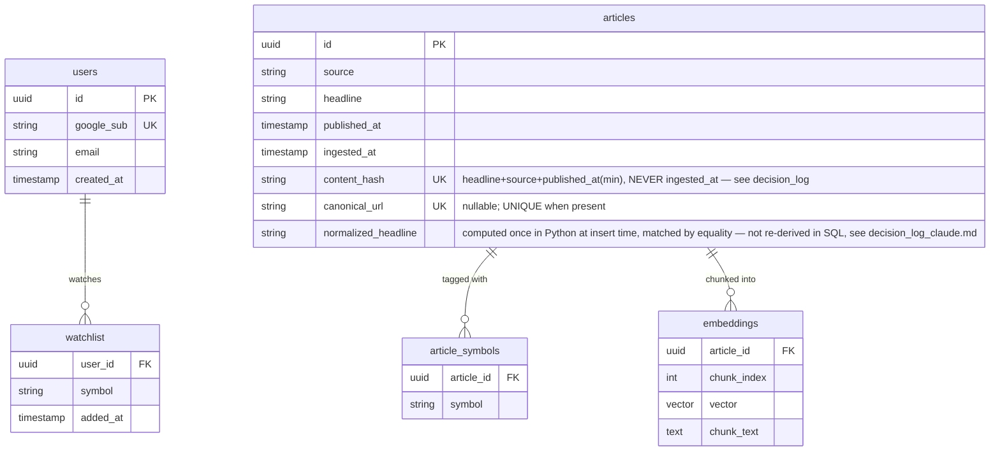
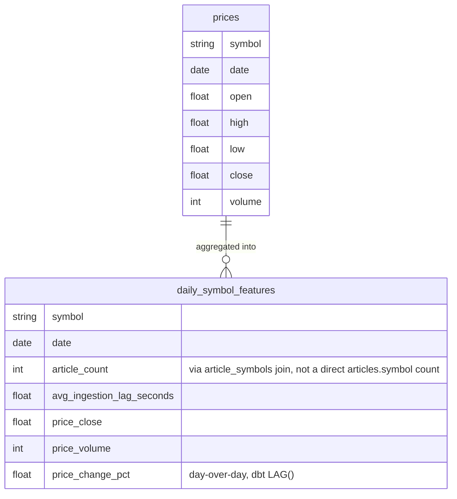
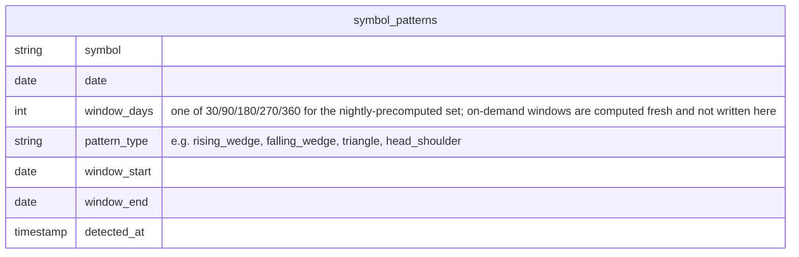

# ER diagram

Source of truth is `stock-news-digest-requirements.md` §7. This isn't one physical database — it's split across two engines (§4.6, §6), which changes what "foreign key" means in each half; noted below.

## Postgres (Supabase, pgvector) — v1

**Constraints that matter beyond the shape** (§4.3, §7 — these are why the dedup design actually holds):
- `articles.content_hash` UNIQUE, `ON CONFLICT (content_hash) DO UPDATE SET content_hash = EXCLUDED.content_hash RETURNING id, (xmax = 0) AS inserted` — one atomic round trip, not a separate `DO NOTHING` + follow-up `SELECT`, since that left a real gap where a concurrent insert landing between the two statements could make the `SELECT` return zero rows (found and fixed during implementation, `decision_log_claude.md`)
- `articles.canonical_url` UNIQUE when present, same `DO UPDATE ... RETURNING` pattern — closes the cross-source race whenever a source exposes a URL
- `articles_fuzzy_match_idx` on `(published_at, normalized_headline)` — backs tier 3's lookup; `normalized_headline` is computed once in Python and matched by plain equality, deliberately not re-derived with a second SQL-side regex (an earlier version did, and diverged from the Python normalization on non-ASCII headlines — `decision_log_claude.md`)
- `article_symbols` composite UNIQUE `(article_id, symbol)`, `ON CONFLICT DO NOTHING` — makes the symbol-tagging insert idempotent; this one genuinely is `DO NOTHING`, since there's nothing to update on a repeat tag
- `article_symbols` is deliberately many-to-many — one article can legitimately cover multiple tickers (sector news, or discovered via polling two different symbols)
- The one case with no hard constraint: cross-source matching via fuzzy-matched headline when no URL exists (§4.3's tier 3) — accepted, low-frequency edge case, not enforced at the DB level

## BigQuery — v1

Locally, this lives in the same Postgres instance as the tables above (`infra/postgres/init.sql`) — no local BigQuery emulator exists, unlike Pub/Sub (`project-structure.md`); dbt's postgres adapter targets it locally and the real BigQuery adapter after the milestone 7 cloud migration (`decision_log.md`).

- `prices` is **append-only, no rolling deletion** (§4.6, §5) — there is no FK from BigQuery back to Postgres; the join between `prices`/`daily_symbol_features` and `articles`/`article_symbols` happens inside the dbt model, not as an enforced database relationship, since they're different engines.
- `daily_symbol_features`'s date grain is the **union** of `prices` dates and article-activity dates, not gated on a `prices` row existing (§4.6) — a weekend with news but no trading still gets a row; price columns are null on those rows.
- Materialized as a dbt table (`materialized: table`), not a view — the aggregation is expensive enough and read frequently enough to earn it (§4.6).

## BigQuery — v2 additions (§12.5, not built yet)

Also v2: `articles.sentiment_score` (FinBERT, positive_prob − negative_prob) and `daily_symbol_features.avg_sentiment` (aggregated from it) — columns added to the v1 tables above, not new tables.
